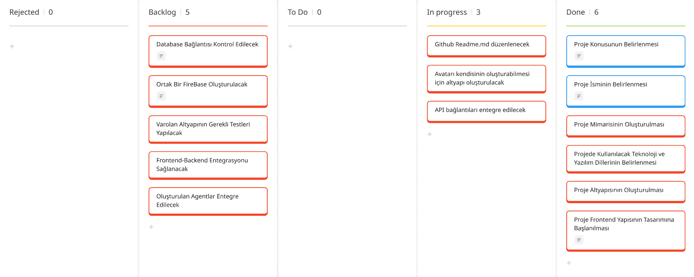
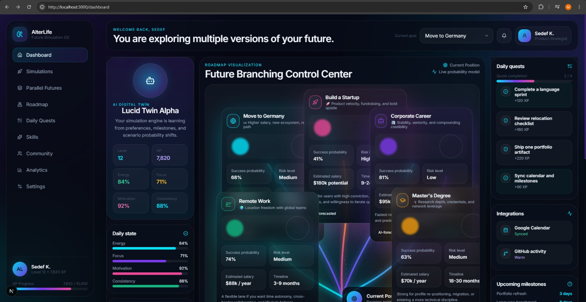
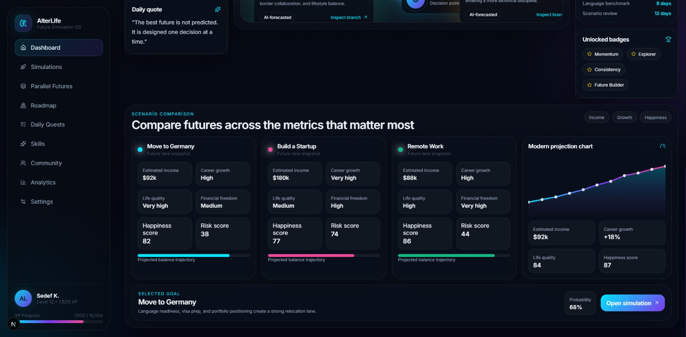
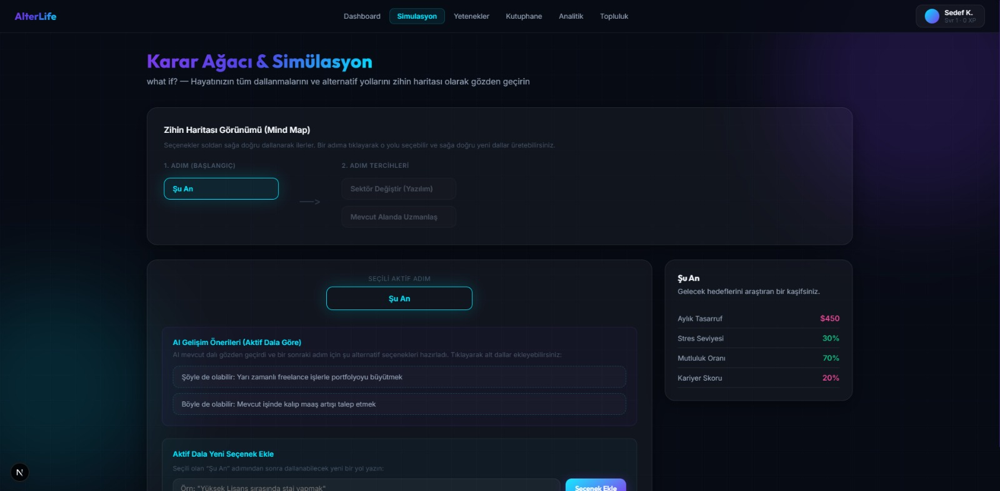
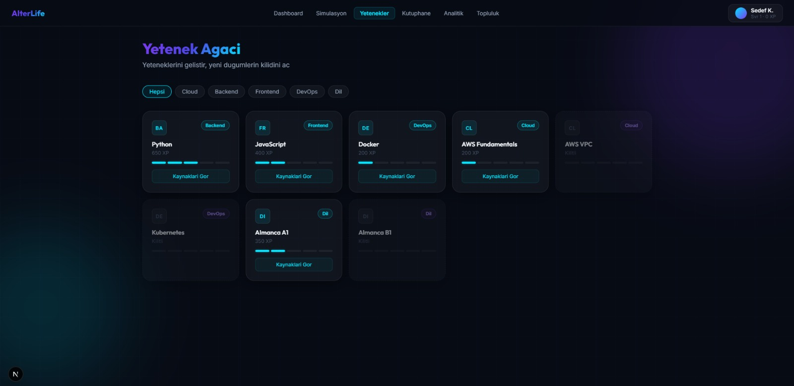
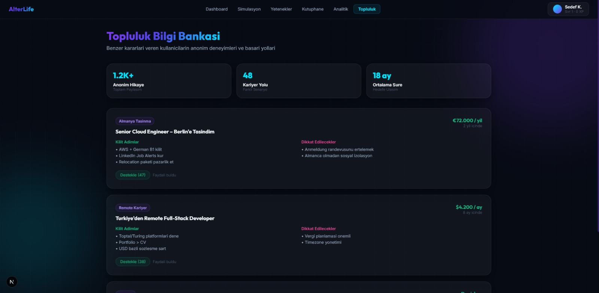
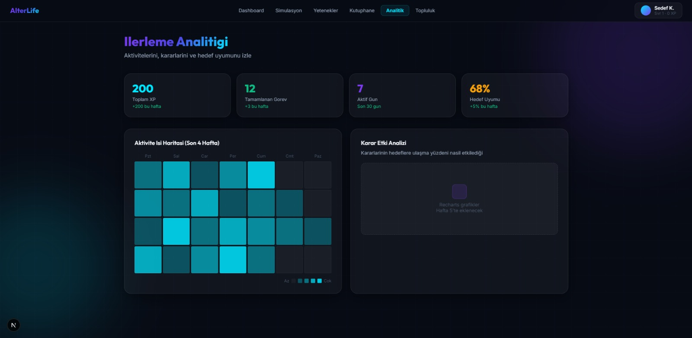

## **Takım İsmi**

**AlterLife**

## Takım Elemanları

| Name | Role |
| --- | --- |
| Sedef Kazan | Product Owner |
| Muhammed Güler | Scrum Master |
| Beyza Gümüş | Developer |

## Ürün İsmi

**AlterLife**

## Ürün Açıklaması

AlterLife, kullanıcıların kariyer, eğitim, yurt dışına taşınma, girişim kurma veya yeni beceriler edinme gibi önemli yaşam kararlarını daha bilinçli verebilmelerini amaçlayan yapay zeka destekli bir karar destek platformudur. Sistem, kullanıcının mevcut durumunu analiz ederek dijital bir ikiz oluşturur ve farklı yaşam senaryolarını gerçek dünya verileri ile yapay zeka analizlerini kullanarak simüle eder. Amaç, geleceği tahmin etmek değil; farklı kararların olası etkilerini analiz ederek kullanıcının daha veri odaklı kararlar almasına yardımcı olmaktır.

## Öne Çıkan Özellikler

- Dijital ikiz oluşturma ve kullanıcı durumu analizi
- Senaryo simülasyonu ve karşılaştırma
- Kişiselleştirilmiş yol haritaları ve günlük görev önerileri
- Risk değerlendirmesi ve veri destekli karar önerileri

## Hedef Kitle

Kariyer değişikliği düşünenler, yurt dışına taşınma planlayanlar, girişim kurmayı hedefleyenler veya yeni beceriler edinmek isteyen bireyler.

## Product Backlog

[Jira Backlog Board](https://alterlife129.atlassian.net/jira/software/projects/SCRUM/boards/1/backlog)  
[Miro Backlog Board](https://miro.com/app/board/uXjVH768XmA=/?share_link_id=586335526829)

---

## Sprint 1

- **Backlog düzeni ve Story seçimleri**: Backlog'umuz ilk yapılacak story'lere göre düzenlenmiştir. Sprint başına tahmin edilen puan sayısını geçmeyecek şekilde sıradan seçimler yapılmaktadır. Story başına çıkan tahmin puanı, toplam puanın yarısından az tutulmuştur.

Story'ler yapılacak işlere (task'lere) bölünmüştür. Miro Board'da gözüken kırmızı item'lar yapılacak işleri (task) gösterirken, mavi item'lar story'leri temsil etmektedir.

- **Daily Scrum**: Daily Scrum toplantılarının zamansal sebeplerden ötürü Slack üzerinden yapılmasına karar verilmiştir. Daily Scrum toplantısı örneği jpeg veya word olarak Readme'de tarafımızdan paylaşılmaktadır: [Sprint 1 Daily Scrum Chats](https://imgur.com/a/9oJWRJ4)

**Sprint board update**: Sprint board screenshotları:

**Ürün Durumu**: Ekran görüntüleri:

---

**Sprint Review**

- Kararlar: Kullanıcı verileri için bir veritabanı gerektiği teyit edildi; temel veritabanı gereksinimleri ve şema taslağı oluşturuldu. Veritabanı form sayfası bazı senaryolarda ertelendi ve ilgili PBI bir sonraki sprint'e taşındı. Frontend prototipleri çalıştırıldı ve temel akışlarda kritik bir hata bulunmadı. UI düzeltmeleri, API entegrasyonları ve avatar altyapısı öncelikli yeni PBI'lar olarak belirlendi.

- Katılımcılar: Sedef Kazan (PO), Muhammed Güler (SM), Beyza Gümüş (Developer).

**Sprint Retrospective**

- Neler iyi gitti: Proje ismi, mimari ve temel altyapı hızlıca kararlaştırıldı; frontend tasarımına çabuk başlangıç yapıldı.
- İyileştirilecekler: Görev dağılımı daha net planlanacak; tahmin puanlama süreçleri gözden geçirilecek; unit ve entegrasyon testleri için daha fazla zaman ayrılacak.
- Eylem maddeleri:
	1. Veritabanı PBI'sını detaylandırıp bir sonraki sprint'e ekle.
	2. Test planı hazırlayıp test zamanlamasını belirle.
	3. Avatar altyapısı gereksinimlerini netleştir ve API entegrasyonu için checklist oluştur.

---
