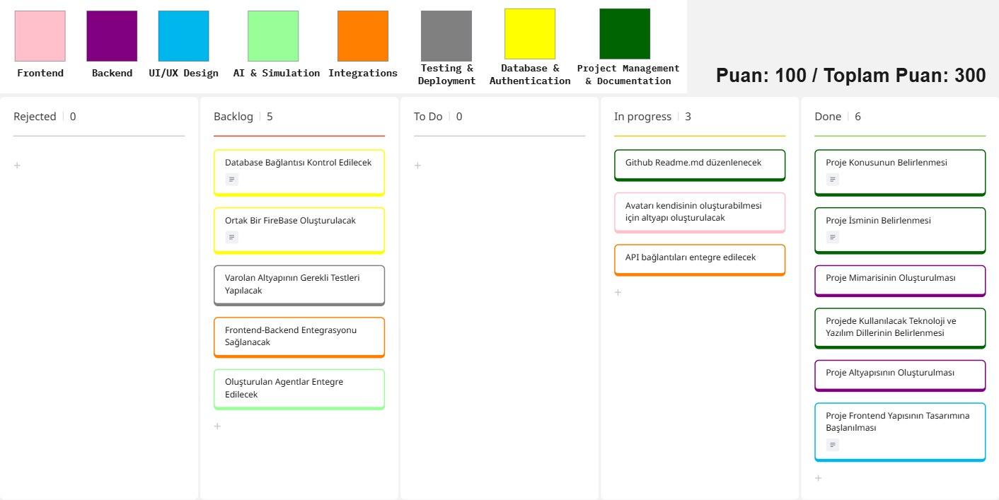
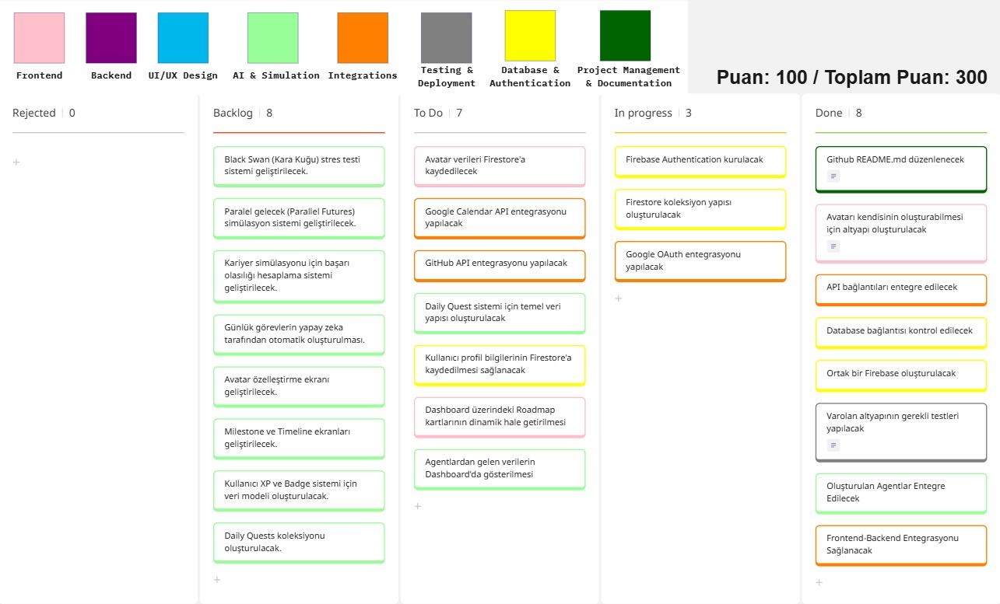

## **Takım İsmi**

**AlterLife**

## Takım Elemanları

| Name | Role |
| --- | --- |
| Sedef Kazan | Product Owner |
| Muhammed Güler | Scrum Master |
| Beyza Gümüş | Developer |

## Ürün İsmi

**AlterLife**

## Ürün Açıklaması

AlterLife, kullanıcıların kariyer, eğitim, yurt dışına taşınma, girişim kurma veya yeni beceriler edinme gibi önemli yaşam kararlarını daha bilinçli verebilmelerini amaçlayan yapay zeka destekli bir karar destek platformudur. Sistem, kullanıcının mevcut durumunu analiz ederek dijital bir ikiz oluşturur ve farklı yaşam senaryolarını gerçek dünya verileri ile yapay zeka analizlerini kullanarak simüle eder. Amaç, geleceği tahmin etmek değil; farklı kararların olası etkilerini analiz ederek kullanıcının daha veri odaklı kararlar almasına yardımcı olmaktır.

## Öne Çıkan Özellikler

- Dijital ikiz oluşturma ve kullanıcı durumu analizi
- Senaryo simülasyonu ve karşılaştırma
- Kişiselleştirilmiş yol haritaları ve günlük görev önerileri
- Risk değerlendirmesi ve veri destekli karar önerileri

## Hedef Kitle

Kariyer değişikliği düşünenler, yurt dışına taşınma planlayanlar, girişim kurmayı hedefleyenler veya yeni beceriler edinmek isteyen bireyler.

## Product Backlog

[Jira Backlog Board](https://alterlife129.atlassian.net/jira/software/projects/SCRUM/boards/1/backlog)  
[Miro Backlog Board](https://miro.com/app/board/uXjVH768XmA=/?share_link_id=586335526829)

---

## Sprint 1

- **Sprint Notları**: Sprint 1 kapsamında projenin temel yapısının oluşturulması hedeflenmiştir. Projenin kapsamı belirlenmiş, kullanılacak teknolojilere karar verilmiş ve frontend geliştirme sürecine başlanmıştır. Ayrıca projenin mimarisi ve ilerleyen sprintlerde gerçekleştirilecek geliştirmeler için gerekli planlamalar yapılmıştır.

- **Sprint içinde tamamlanması tahmin edilen puan**: 100 Puan

- **Puan tamamlama mantığı**: Proje boyunca tamamlanması gereken toplam 300 puanlık backlog bulunmaktadır. Backlog'un 3 sprinte bölünmesi planlandığından ilk sprint için hedef puan 100 olarak belirlenmiştir.

- **Backlog düzeni ve Story seçimleri**: Backlog, projenin temel gereksinimlerinin belirlenmesi ve sonraki sprintlerin altyapısını oluşturacak görevler göz önünde bulundurularak hazırlanmıştır. Sprint başına tahmin edilen puan sayısını geçmeyecek şekilde görev dağılımı yapılmıştır.

Miro Board üzerinde;
- Mavi item'lar UI/UX tasarım görevlerini,
- Pembe item'lar frontend geliştirme görevlerini,
- Mor item'lar backend geliştirme görevlerini,
- Açık yeşil item'lar yapay zeka ve simülasyon sistemlerine ait görevleri,
- Turuncu item'lar üçüncü parti servis entegrasyonlarını,
- Sarı item'lar veritabanı ve kimlik doğrulama işlemlerini,
- Gri item'lar test ve deployment süreçlerini,
- Koyu yeşil item'lar ise proje yönetimi ve dokümantasyon görevlerini temsil etmektedir.

Sprint sonlarında ekip üyelerinin eksik görevleri tamamlayabilmesi ve sprint değerlendirmelerinin yapılabilmesi amacıyla belirli günler boş bırakılmıştır.

- **Daily Scrum**: Daily Scrum toplantılarının zamansal sebeplerden ötürü Google Meet üzerinden yapılmasına karar verilmiştir. Daily Scrum toplantılarımız ve günlük WhatsApp konuşmalarımız Imgur'da toplanmıştır.
[Sprint 1 Daily Scrum Chats](https://imgur.com/a/9oJWRJ4)

- **Sprint board update**: Sprint board screenshot:

<h3>Ürün Durumu: Ekran Görüntüleri</h3>

---

### Sprint Review

- Projenin konusu ve ismi ekip üyeleri tarafından belirlenmiştir.
- Projede kullanılacak teknoloji yığını (Frontend, Backend, AI ve veritabanı teknolojileri) kararlaştırılmıştır.
- AlterLife için sistem mimarisi oluşturulmuş ve geliştirme sürecinin genel planlaması yapılmıştır.
- Projenin temel altyapısı hazırlanmış ve frontend geliştirme çalışmalarına başlanmıştır.
- Dashboard ve temel kullanıcı arayüzü bileşenlerinin tasarımı gerçekleştirilmiştir.
- Bir sonraki sprintte gerçekleştirilecek Firebase, API entegrasyonları ve AI agent geliştirmeleri için gerekli teknik gereksinimler belirlenmiştir.

- Sprint Review katılımcıları: Sedef Kazan (PO), Muhammed Güler (SM), Beyza Gümüş (Developer).

### Sprint Retrospective

- Neler iyi gitti:
    - Projenin kapsamı ve vizyonu kısa sürede netleştirildi.
    - Kullanılacak teknolojiler ve sistem mimarisi konusunda ekip içerisinde fikir birliğine varıldı.
    - Frontend tasarım çalışmalarına planlanandan erken başlanabildi.

- İyileştirilecekler:
    - Görev dağılımlarının sprint başlangıcında daha detaylı planlanması.
    - Teknik görevlerin daha küçük ve takip edilebilir alt görevlere ayrılması.
    - Sprint planlaması sırasında geliştirme ve test süreçlerinin daha detaylı belirlenmesi.

- Eylem maddeleri:
    1. Firebase ve kimlik doğrulama sistemi için gerekli yapıların planlanması.
    2. API ve üçüncü parti servis entegrasyonları için görevlerin oluşturulması.
    3. AI agent mimarisinin ve veri modellerinin detaylandırılması.
    4. Kullanıcı profil ve avatar sistemine ilişkin gereksinimlerin belirlenmesi.

---

## Sprint 2

- Sprint Notları: Backlog, projenin temel özelliklerinin geliştirilmesine yönelik olarak düzenlenmiştir. Sprint başına tahmin edilen puan sayısını aşmayacak şekilde görev dağılımı yapılmış ve her User Story için belirlenen puanların toplam sprint puanının yarısından az olmasına dikkat edilmiştir.

- Sprint içinde tamamlanması tahmin edilen puan: 100 Puan

- Puan tamamlama mantığı: Proje boyunca tamamlanması gereken toplam 300 puanlık backlog bulunmaktadır. Backlog'un 3 sprintte tamamlanması planlandığından, Sprint 2 için hedef puan 100 olarak belirlenmiştir.

- Backlog düzeni ve Story seçimleri: Backlog, projenin kullanıcıya sunacağı temel özellikler ve teknik gereksinimler göz önünde bulundurularak oluşturulmuştur. Görevler sprint puanını aşmayacak şekilde planlanmış ve ekip üyeleri arasında dağıtılmıştır.

Miro Board üzerinde;
- Mavi item'lar UI/UX tasarım görevlerini,
- Pembe item'lar frontend geliştirme görevlerini,
- Mor item'lar backend geliştirme görevlerini,
- Açık yeşil item'lar yapay zeka ve simülasyon sistemlerine ait görevleri,
- Turuncu item'lar üçüncü parti servis entegrasyonlarını,
- Sarı item'lar veritabanı ve kimlik doğrulama işlemlerini,
- Gri item'lar test ve deployment süreçlerini,
- Koyu yeşil item'lar ise proje yönetimi ve dokümantasyon görevlerini temsil etmektedir.

Sprint sonlarında ekip üyelerinin eksik görevleri tamamlayabilmesi, sprint değerlendirmelerinin yapılabilmesi ve gerekli iyileştirmelerin planlanabilmesi amacıyla belirli günler boş bırakılmıştır.

- Daily Scrum: Daily Scrum toplantıları Google Meet üzerinden yapılmaya devam edilmiştir. Günlük toplantı notları ve ekip içi WhatsApp yazışmaları Imgur üzerinde paylaşılmıştır.
[Sprint 2 - Daily Scrum Chats](https://imgur.com/a/DpFmywv)

- Sprint Board Update:
Sprint board screenshot:
 

<h3>Ürün Durumu: Ekran Görüntüleri</h3>

- Sprint Review:
  - Dashboard arayüzünün geliştirilmesi tamamlanmış ve kullanıcı deneyimi açısından gerekli düzenlemeler yapılmıştır.
  - Firebase Authentication, Firestore veri yapısı ve Google OAuth entegrasyonları üzerinde çalışılmaya başlanmıştır.
  - Frontend ve Backend arasındaki veri iletişimi test edilmiş ve gerekli entegrasyonlar sağlanmıştır.
  - Yapay zeka ajanlarının entegrasyonu ve verdikleri yanıtlar test edilmiş, geliştirilebilecek noktalar ekip tarafından değerlendirilmiştir.
  - Sprint kapsamında gerçekleştirilen geliştirmeler ekip üyeleri tarafından incelenmiş ve bir sonraki sprint için öncelikli görevler belirlenmiştir.
  - Sprint Review katılımcıları: Sedef Kazan (PO), Muhammed Güler (SM), Beyza Gümüş (Developer).

- Sprint Retrospective:
  - Takım içindeki görev dağılımının daha dengeli yapılmasına karar verilmiştir.
  - API ve servis entegrasyonlarının daha erken planlanmasının geliştirme sürecini hızlandıracağı değerlendirilmiştir.
  - Bir sonraki sprintte AI simülasyon sistemi ve kullanıcı verilerinin işlenmesine öncelik verilmesi kararlaştırılmıştır.

---