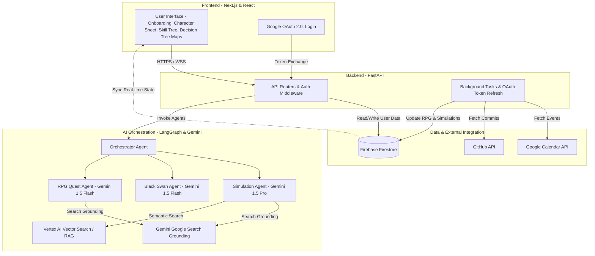
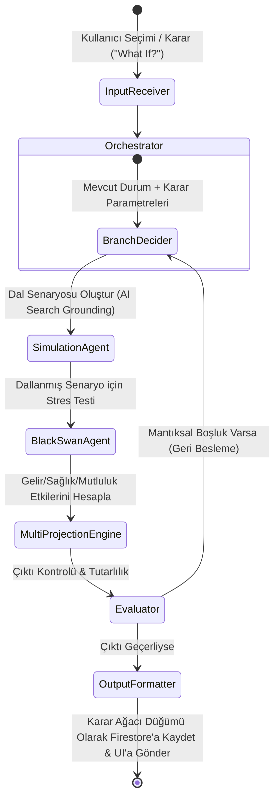

# **Takım 129**

## Ürün İsmi
**AlterLife** (Hayat İçin Dijital İkiz ve RPG Karar Motoru)

## Takım Elemanları
- **Muhammed Güler** - Scrum Master
- **Sedef Kazan** - Product Owner
- **Beyza Gümüş** - Developer / Team Member

---

# Alter Life: Mimari ve Teknik Gereksinimler Dokümanı

Bu doküman, **Alter Life** (Hayat İçin Dijital İkiz ve RPG Karar Motoru) projesinin uçtan uca mimarisini, sayfa tasarımlarını, onboarding soru akışlarını, veri modellerini, yapay zeka ajan kurgularını, entegrasyon stratejilerini, API uç noktalarını (REST API) ve geliştirme ortamı (Docker & venv) kurulumlarını tanımlar.

---

## 1. Proje Vizyonu ve Hibrit Tasarım

**Alter Life**, ciddi bir gelecek senaryosu simülatörü ile oyunlaştırılmış bir kişisel gelişim (RPG) sistemini birleştiren **hibrit** bir platformdur. Platform, sadece statik bir hedef planlayıcı değil, çok yönlü bir **"Kişisel Karar Destek Sistemi" (Personal Decision Support System)** olarak çalışır.

```
+---------------------------------------------------------------------------------+
|                                  ALTER LIFE UX                                  |
+--------------------------------------------------------+------------------------+
|  1. ANALİTİK PANEL (Karar Destek)                      | 2. HAYAT RPG'Sİ        |
|  * Dallanan Evren Simülatörü ("Şöyle Olsa Ne Olur?")    | * Karakter Stat Kartı  |
|  * Karar Ağacı Projeksiyonları (Recharts)              | * Kişiselleştirilmiş   |
|  * Black Swan Stres Testi (Dayanıklılık Skoru)          |   AI RPG Avatarı       |
|  * Kariyer, Finans, Sağlık & Aşk Dalları               | * İnteraktif Yetenek   |
|  * Canlı Arama Destekli Kaynak ve Kurs Önerileri       |   Ağacı (Skill Tree)   |
+--------------------------------------------------------+------------------------+
```

*   **Dallanan Gelecek Simülatörü ("What If" Engine):** Kullanıcı sadece profesyonel hedefler değil, hayata dair anlık veya stratejik tüm yol ayrımlarını simüle edebilir. ("Almanya'ya gidersem ne olur?", "Yüksek lisans yaparsam?", "Cloud'a geçersem?", "Şirket değiştirirsem?", "Aşık olursam ne olur?").
*   **Arayüz Estetiği:** Koyu mod ağırlıklı, modern neon/glassmorphism (cam efekti) çizgiler barındıran, hem analitik netliği (grafikler) hem de RPG hissini (yetenek ağaçları, XP barları) uyum içinde yaşatan premium bir tasarım.
*   **Arama Temelli Kararlar:** Sistem, kullanıcıya yönlendirme yaparken sadece statik veri tabanına değil; **canlı web araştırmalarına (Gemini Google Search Grounding, YouTube Data API ve Udemy Affiliate API)** dayanarak gerçek zamanlı kurs, video, makale ve dokümantasyon önerir.

---

## 2. Onboarding (Karakter Oluşturma) ve AI Avatar Akışı

Kullanıcı sisteme kayıt olduğunda, geleneksel formlar yerine bir RPG oyununun **"Karakter Yaratma" (Character Creation)** ekranı ile karşılanır. Bu aşamada yapay zekanın dijital ikizi beslemesi ve kişisel RPG avatarını üretmesi için şu akış uygulanır:

### Aşama 2.1: Profil ve Geçmiş (Mevcut Durum)
1.  **Sınıf Seçimi / Mevcut Rol:** "Mevcut mesleğiniz veya odaklandığınız alan nedir?" (Örn: Junior Web Developer, Student, Finans Analisti).
2.  **Yetenekler (Skills):** "Hangi teknik becerilere sahipsiniz? (Seviyeleriyle seçin/yazın)" (Örn: Python [Orta]).
3.  **Dil Seviyeleri:** "Bildiğiniz yabancı diller ve seviyeleri?" (Örn: İngilizce [B2], Almanca [A1]).
4.  **Finansal Cephane (Financial Stats):** "Aylık ortalama tasarrufunuz ve mevcut toplam birikiminiz nedir?".

### Aşama 2.2: AI Karakter Avatarı Oluşturma (Görsel Özelleştirme)
Kullanıcı panellerde kendini temsil edecek RPG karakterini iki şekilde tasarlayabilir:
*   **Seçenek 1: Fiziksel Özellik Betimlemesi (Text-to-Image):** Kullanıcı saç rengi, göz rengi, tarzı ve aksesuarlarını yazar (Örn: "Mavi gözlü, kısa siyah saçlı, cyberpunk gözlüğü takan, kapüşonlu hırka giyen bir yazılımcı").
*   **Seçenek 2: Fotoğraf Yükleme (Image-to-Image / Vision):** Kullanıcı kendi fotoğrafını yükler. **Gemini 1.5 Pro / Flash (Vision)** fotoğrafı analiz ederek kullanıcının yüz hatlarını, saç tarzını ve giyimini betimleyen detaylı bir prompt hazırlar.
*   **Üretim Motoru (Avatar Generator):** Çıkan metinsel prompt, sistem tarafından belirlenen sanatsal stile (örn. *Cyberpunk Glassmorphism Illustration* veya *Futuristic Pixel Art*) uydurulacak şekilde harmanlanır ve bir Görsel Üretim Modeli (örn. Imagen 3 veya DALL-E) ile **RPG karakter görseline** dönüştürülür. Üretilen avatar görseli Firebase Storage'a yüklenir.

### Aşama 2.3: İlk Serüven Tanımlama
*   **Seçenek A: Şablon Senaryolar (Hazır Questler):** "2 yıl içinde Berlin'de Senior Cloud Engineer olmak."
*   **Seçenek B: Bağımsız / Özel Hedef (Serbest Giriş):** Kullanıcı bağımsız hedefini yazar, AI canlı web araştırması (Search Grounding) ile buna özel bir yol haritası ve RPG görevleri çıkarır.

---

## 3. Sayfa Yapıları ve İçerikleri (9 Temel Sayfa)

### 3.1. Giriş Sayfası (`/login`)
*   **Arayüz Bileşenleri:** Fütüristik "Enter the Simulation" temalı glassmorphism panel. Google OAuth "Tek Tıkla Giriş" butonu ve e-posta/şifre alanları.

### 3.2. Kayıt & Onboarding Sayfası (`/onboarding`)
*   **Arayüz Bileşenleri:** RPG tarzı adımlı form geçişleri. Karakter sınıfı ve yetenek seçiciler. AI Avatar fotoğraf yükleyicisi veya metin alanı.

### 3.3. Ana Panel / Karakter Kartı & Görevler (`/dashboard`)
*   **Arayüz Bileşenleri:**
    *   **Karakter Stat Kartı:** Sol üstte üretilen **AI RPG Avatarı**, seviye, XP barı, unvan ve temel yetenek puanları (Gelişim Puanları).
    *   **Daily Quests (Günlük Görevler):** O gün yapılması gereken görevlerin checkbox listesi.
    *   **Entegrasyon Hub'ı:** Google Calendar ve GitHub API durum kartları.

### 3.4. Karar Ağacı & Dallanan Evrenler (`/simulations`)
*   **Arayüz Bileşenleri:**
    *   **Karar Ağacı Görselleştiricisi (Interactive Decision Tree):** Kullanıcının ana karar düğümlerini (Nodes) ve buralardan dallanan gelecek olasılıklarını (Örn: "Almanya'ya Git", "Mevcut Yerde Kal", "İstifa Et", "Evlen / Aşık Ol") gösteren interaktif bir node haritası.
    *   **"What If...?" (Şöyle Olsa Ne Olur?) Paneli:** Kullanıcının serbestçe bir karar yazabileceği girdi alanı. (Örn: "Aşık olup kariyeri yavaşlatırsam ne olur?"). AI bu girdiyi alır, mevcut verilere (finans, hedefler, geçmiş kararlar) göre yeni bir alt dal (Branch) üretir ve ağaca ekler.
    *   **Metrik Projeksiyonu (Recharts):** Seçilen dalın finansal durum, stres seviyesi, zaman özgürlüğü ve mutluluk skoru üzerindeki tahmini etkilerini gösteren çizgi grafikleri.
    *   **Black Swan Alarm Butonu:** Tıklandığında seçili daldaki stres testi krizlerini tetikler.

### 3.5. Yetenek Ağacı Sayfası (`/skills`)
*   **Arayüz Bileşenleri:** SVG/Canvas tabanlı, Framer Motion ile hareketlendirilmiş yetenek düğümleri. Üzerine tıklandığında YouTube, Udemy ve resmi dokümantasyon önerileri barındıran modal.

### 3.6. Kaynaklarım / Kütüphane (`/library`)
*   **Arayüz Bileşenleri:** AI'ın önerdiği ve kullanıcının kaydettiği tüm eğitim kaynaklarının (Udemy, YouTube vb.) listesi.

### 3.7. İlerleme Analitiği / Zaman Tüneli (`/analytics`)
*   **Arayüz Bileşenleri:** Aktivite Isı Haritası (Calendar + GitHub) ve kararların hedeflere ulaşma yüzdelerini nasıl etkilediğinin geçmiş analizi.

### 3.8. Topluluk Bilgi Bankası (`/community`)
*   **Arayüz Bileşenleri:** Benzer kararları vermiş diğer Alter Life kullanıcılarının anonim verileri, maaş istatistikleri ve yaşam deneyimleri.

### 3.9. Ayarlar & Entegrasyon Yönetimi (`/settings`)
*   **Arayüz Bileşenleri:** Google Calendar ve GitHub API entegrasyon ayarları, profil düzenleme, avatarı yeniden üretme alanı.

---

## 4. Günlük Görev (Daily Quest) ve RPG İlerleme Motoru

Kullanıcının belirlediği hedeflere ve dallanan kararlara yönelik ilerlemesi, statik bir takvim takibi yerine oyunlaştırılmış bir **RPG Quest Engine** ile yönetilir.

### 4.1. Görev Üretim Mantığı (Daily Quest Generation)
Yapay zeka (Quest Generator Agent - Gemini 1.5 Flash) her gece veya yeni bir karar dalı oluşturulduğunda şu mantıkla görev üretir:
1.  **Aktif Kilometre Taşı Analizi:** Kullanıcının seçili karar dalındaki mevcut aşaması (örn. "AWS Cloud Foundations") ve odaklandığı yetenek (örn. "AWS VPC") belirlenir.
2.  **Canlı Arama & Kaynak İlişkilendirme:** YouTube ve Udemy API'lerinden bu yeteneğe uygun en popüler 3 kaynak taranır.
3.  **Mikro Görev Üretimi:** Büyük hedef 3 adet günlük mikro göreve bölünür:
    *   *Görev 1 (Teorik/Öğrenim):* Önerilen video veya dökümandan 20 dakika çalışmak. (Doğrulama: `calendar_sync` veya manuel).
    *   *Görev 2 (Pratik/Uygulama):* Konuyla ilgili kod yazmak veya test yapmak (Örn: "Docker Compose dosyası oluşturup ayağa kaldır"). (Doğrulama: `github_commit` veya manuel).
    *   *Görev 3 (Genel Gelişim/Dil/Sosyal):* Hedef ülkeye dair dil çalışması veya sektörel bir okuma.

### 4.2. Doğrulama ve XP Akışı (Verification & XP Progression)
*   **Takvim Senkronizasyonu ile Doğrulama:** Arka plan işleyicisi (Sync Worker) kullanıcının Google Calendar'ında `[AlterLife]` etiketiyle açılmış ve o gün tamamlanmış etkinlik sürelerini okur. Süre tamamsa göreve otomatik `completed` işareti koyar.
*   **GitHub API ile Doğrulama:** Kod tabanlı görevlerde, kullanıcının GitHub reposuna o gün attığı commit verileri sorgulanır. Commit tespit edilirse ilgili görev onaylanır.
*   **XP ve Level Up Formülü:**
    *   Her tamamlanan görev zorluğuna göre `50 - 200 XP` arası ödül verir.
    *   Bir sonraki seviye için gereken XP formülü: $XP_{sonraki} = Seviye \times 1000$ (Örn: Lvl 1 -> Lvl 2 için 1000 XP; Lvl 2 -> Lvl 3 için 2000 XP).
    *   Kullanıcı seviye atladıkça yeni unvanlar açılır, interaktif Yetenek Ağacında (`/skills`) yeni düğümlere erişim hakkı kazanır.

---

## 5. Sistem Mimarisi & Veri Akışı

Sistem, kullanıcı etkileşimini ve dinamik arka plan güncellemelerini yönetebilmek için **olay tabanlı (event-driven) ve ajan odaklı (agentic)** bir yapıda tasarlanmıştır.



---

## 6. LangGraph Karar Ağacı & Ajan Akışı (State Diagram)

LangGraph, dallanan kararları ve "What If" simülasyonlarını üretirken döngüsel ve koşullu ajan akışlarını yönetir.



---

## 7. Geliştirme ve Çalıştırma Ortamı Alternatifleri

Geliştiricinin tercihine göre sistem hem yerel **Python sanal ortamı (venv) + npm** ile hem de **Docker Compose** ile çalıştırılabilir. Detaylı adım adım rehber için [INSTALL.md](file:///Users/sedefesrakazan/AlterLife/INSTALL.md) dosyasına göz atabilirsiniz.

### Alternatif A: Yerel venv + Node.js (Önerilen Hızlı Geliştirme Yolu)
Yerel çalıştırma, macOS üzerinde daha hızlı dosya değişimi (hot-reload) sağlar, işlemci/RAM tüketimi düşüktür ve kod hata ayıklama (debugging) işlemlerini kolaylaştırır.

1.  **Backend Çalıştırma:**
    ```bash
    cd backend
    python3 -m venv .venv
    source .venv/bin/activate
    pip install -r requirements.txt
    uvicorn main:app --reload --port 8001
    ```
2.  **Frontend Çalıştırma:**
    ```bash
    cd frontend
    npm install
    npm run dev -- --port 3001
    ```

### Alternatif B: Docker & Docker Compose
Bilgisayara Python veya Node.js bağımlılıklarını kurmadan, izole bir şekilde sistemi tek komutla ayağa kaldırmak için kullanılır.

*   **Komut:** `docker compose up --build`
*   **Port Dağılımı:** Frontend `http://localhost:3000` ve Backend `http://localhost:8000` portları üzerinden haberleşir. Konteynerler izole üretim (standalone) modunda stabil olarak çalışır.

---

## 8. Entegre Edilen Dış API Servisleri

*   **YouTube Data API v3:** Yetenek ağacı ve günlük görevlerle ilgili en alakalı 3 adet video/eğitim linkini ve thumbnail görsellerini getirmek.
*   **Udemy Course Search API:** Profesyonel eğitim tavsiyelerini fiyat, puan ve bağlantı URL'si ile birlikte çekmek.
*   **Google Calendar API (OAuth 2.0):** Kullanıcının takviminden çalışma zamanlarını çekip RPG yetenek gelişimine ve simülasyon olasılıklarına yansıtmak.
*   **GitHub API:** Kullanıcının kod yazma sıklığını ve commit'lerini kontrol ederek günlük görevleri otomatik onaylamak.
*   **Gemini Google Search Grounding & Vision:** Canlı web araştırmaları ve fotoğraf analiz altyapısı.

---

## 9. Backend REST API Tasarımı (FastAPI Endpoints)

### 9.1. Kimlik Doğrulama & Kullanıcı Yönetimi
*   **`POST /api/v1/auth/google`:** Google OAuth JWT doğrulaması.
*   **`POST /api/v1/user/onboarding`:** Karakter sınıfı, dil seviyeleri, finansal durum kaydı.
*   **`POST /api/v1/user/avatar/generate`:** Fotoğraf analizi/fiziksel betimleme ile RPG avatar üretimi.
*   **`GET /api/v1/user/profile`:** Profil, seviye, XP ve unvan verileri.

### 9.2. Dallanan Karar Simülasyonu ("What If" API)
*   **`POST /api/v1/simulations/generate`:** İlk hedefe yönelik ana simülasyon dalını üretir.
*   **`POST /api/v1/simulations/{simulation_id}/branch`:**
    *   *Girdi:* `{ "parent_node_id": "node_123", "decision_text": "Evlenip tatile çıkmak" }`
    *   *Çıktı:* Yeni düğüm verileri (finansal etki, mutluluk/stres puanları, yeni RPG görevleri).
*   **`GET /api/v1/simulations/{simulation_id}/tree`:** Karar ağacını interaktif frontend haritası için JSON formatında döner.
*   **`POST /api/v1/simulations/{simulation_id}/stress-test`:** Dallanmış senaryolarda kriz senaryosu çalıştırır.

### 9.3. Yetenek Ağacı & Görev Yönetimi
*   **`GET /api/v1/skills/tree`:** İnteraktif yetenek ağacı şeması.
*   **`GET /api/v1/skills/{skill_name}/resources`:** YouTube/Udemy kaynak listesi.
*   **`GET /api/v1/quests/daily`:** Günlük görevler.
*   **`POST /api/v1/quests/{quest_id}/verify`:** Görev tamamlama API'si (Calendar/GitHub kontrolü).

### 9.4. Entegrasyonlar & Kütüphane
*   **`POST /api/v1/integrations/calendar/connect`** / **`POST /api/v1/integrations/github/connect`**
*   **`GET /api/v1/library/resources`** / **`POST /api/v1/library/resources`**

---

## 10. Firestore Veritabanı Tasarımı

### 10.1. `users` Koleksiyonu
*Kullanıcı profili ve RPG verileri.*

```json
{
  "userId": "usr_9823749823",
  "email": "user@alterlife.io",
  "displayName": "Ahmet Yılmaz",
  "createdAt": "2026-06-27T15:00:00Z",
  "profile": {
    "title": "Software Developer",
    "experienceYears": 3,
    "avatarUrl": "https://firebasestorage.googleapis.com/v0/b/alter-life.appspot.com/o/avatars%2Fusr_9823749823.png",
    "skills": {
      "Python": {"level": 3, "xp": 350}
    },
    "languages": {
      "English": "B2"
    }
  },
  "rpgState": {
    "level": 4,
    "xp": 1450,
    "nextLevelXp": 2000,
    "title": "Junior Cyber-Seeker"
  }
}
```

### 10.2. `simulations` Koleksiyonu (Dallanan Yapı)
*Her simülasyon bir **karar ağacı (tree)** şeklinde depolanır.*
```json
{
  "simulationId": "sim_348923749",
  "userId": "usr_9823749823",
  "initialTarget": "2 yıl içinde Berlin'de Senior Cloud Engineer olmak",
  "createdAt": "2026-06-27T15:10:00Z",
  "nodes": [
    {
      "nodeId": "node_root",
      "parent": null,
      "decisionName": "Başlangıç Durumu",
      "metrics": { "monthlySavingsUSD": 500, "stressLevel": 30, "happiness": 70 },
      "description": "Türkiye'de yazılım geliştirici olarak çalışıyorsunuz."
    },
    {
      "nodeId": "node_germany_optimal",
      "parent": "node_root",
      "decisionName": "Almanya'ya Taşınmak",
      "metrics": { "monthlySavingsEUR": 3300, "stressLevel": 60, "happiness": 75 },
      "milestones": ["AWS/German B1", "Relocate to Berlin"]
    },
    {
      "nodeId": "node_marriage_branch",
      "parent": "node_germany_optimal",
      "decisionName": "Berlin'de Evlenmek & Aile Kurmak",
      "metrics": { "monthlySavingsEUR": 1500, "stressLevel": 45, "happiness": 90 },
      "description": "Yaşam maliyetleriniz artıyor, stres azalıyor, aidiyet hissi yükseliyor."
    }
  ]
}
```

### 10.3. `daily_quests` Koleksiyonu
*Kullanıcının hedefine uygun günlük görev dökümanları.*
```json
{
  "questId": "qst_102938102",
  "userId": "usr_9823749823",
  "date": "2026-06-27",
  "title": "AWS VPC Konusunu Çalış",
  "description": "Önerilen kurstaki VPC modülünü bitir veya resmi dökümantasyonu oku.",
  "xpReward": 150,
  "status": "pending",
  "verifiedBy": "github_commit",
  "resourceLink": "https://docs.aws.amazon.com/vpc/latest/userguide/what-is-amazon-vpc.html",
  "completedAt": null
}
```

### 10.4. `community` Koleksiyonu
*RAG veri tabanını besleyecek anonim başarı ve veri dökümanları.*
```json
{
  "communityDataId": "comm_48293749",
  "targetCategory": "germany_relocation",
  "metrics": {
    "averageSalaryEUR": 62000,
    "averageVisaDays": 45,
    "costOfLivingIndex": "Medium"
  },
  "successfulPathNodes": [
    "AWS Certified Solutions Architect",
    "German B1 Language Certificate",
    "Direct Application on LinkedIn"
  ],
  "pitfalls": [
    "Ev bulma randevularını (Anmeldung) son dakikaya bırakmak",
    "Almanca dil bilgisi olmadan sosyal hayata adapte olmak"
  ]
}
```

---

## 11. Geliştirme ve Kurulum Yol Haritası

*   **1. Hafta (Kurulum & Çevre Ayarları):** Sanal ortam (venv) ve npm kurulum süreçlerinin hazırlanması. FastAPI backend ve Next.js frontend temel iskeletlerinin Docker ve venv yapılandırmaları. Sayfa yönlendirmelerinin iskelet hallerinin oluşturulması.
*   **2. Hafta (Dallanan Karar Motoru & AI):** `/simulations/generate` ve `/simulations/{id}/branch` API'lerinin Gemini Google Search Grounding ile yazılması, karar ağacı JSON yapısının kurulması.
*   **3. Hafta:** Google Calendar & GitHub API entegrasyonları, YouTube & Udemy API servislerinin kodlanması.
*   **4. Hafta:** Yetenek Ağacı ve RPG Karakter Kartı UI bileşenlerinin, Karar Ağacı görsel harita arayüzünün kodlanması.
*   **5. Hafta:** Black Swan stres testleri, Recharts performans grafikleri ve E2E testler.
